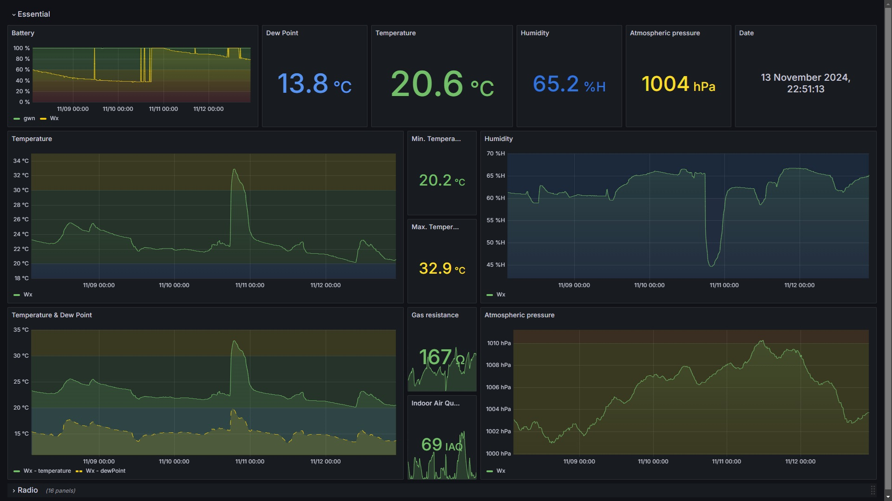
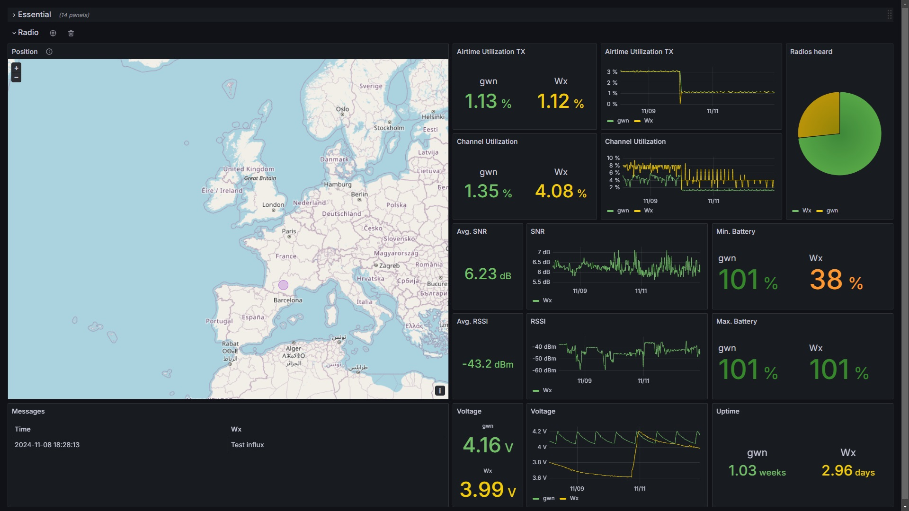

# Meshtrics

Meshtrics is a tool that collects telemetry data from your neighboring radios and allows you to visualize them in a Grafana dashboard. It aims to provide a simple way to monitor your devices in real time. 

## Setup

You will need to : 
- [Install InfluxDB v2]("https://docs.influxdata.com/influxdb/v2/install/") and create an Organization and Bucket
- [Install Grafana]("https://grafana.com/docs/grafana/latest/setup-grafana/")
    - In *Datasources* add a new connection to your new InfluxDB Organization
        - *Query Language* &rarr; Flux
        - *HTTP URL* &rarr; link to your InfluxDB installation
        - *InfluxDB Details*
            - *Organization* &rarr; Your Organization ID
            - *Token* &rarr; The secret Token provided when you created your Organization
            - *Default bucket* &rarr; Your Bucket name
    - Create a new dashboard and import *grafana/grafana_dashboard.json*
        - In *Settings &rarr; Variables &rarr; bucket* add your Bucket name
        - Replace the datasources in each panel with the one you just created
- Have Python (3.13.0 tested)
    - Install requirements &rarr; `pip install -r requirements.txt`
    - Create `env.py` from the example and fill in the data
    - Run the app &rarr; `python main.py`

## Use case
I created Meshtrics to monitor a remote weather station !

## Note

It was created with a RAK4631 connected to USB.

## License

Free to use as desired, please credit !

## Credits

lameslime for inspiration and part of the code https://github.com/lameslime/meshflux